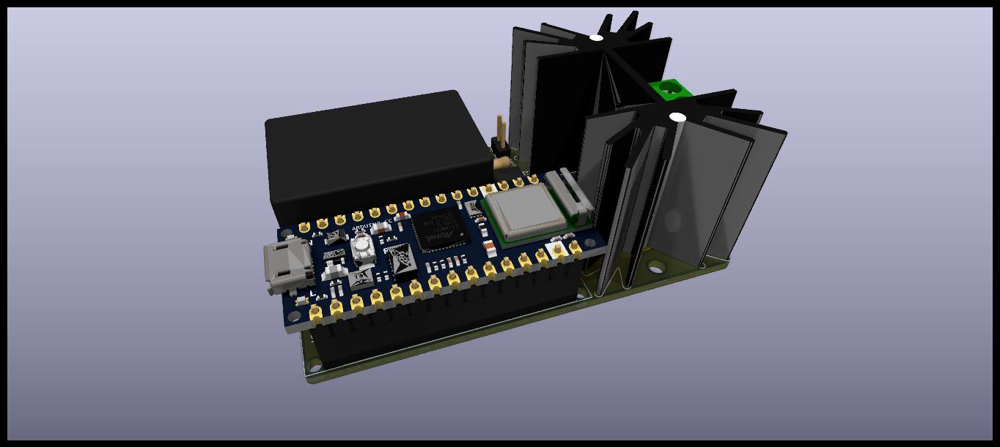

# IoT Solid State Ralay and Power Monitor Shield

Shield made specifically for Arduino nano IoT or compatible development board.
- Based on triac transistor with opto-isolated driving to be used for heater or lighting control IoT applications.
- Isolated 2Watts AC/DC converter.
- Integrates AC power monitor ACS71020KMABTR-030B3-I2C.
- One on board NTC temperature sensor, plus header for off-board NTC. 

## License

KiCad design is available but not verified, use on your own resposibility!

THE DESIGN IS PROVIDED "AS IS" AND THE AUTHOR DISCLAIMS ALL WARRANTIES WITH REGARD TO THIS DESIGN INCLUDING ALL IMPLIED WARRANTIES OF MERCHANTABILITY AND FITNESS. IN NO EVENT SHALL THE AUTHOR BE LIABLE FOR ANY SPECIAL, DIRECT, INDIRECT, OR CONSEQUENTIAL DAMAGES OR ANY DAMAGES WHATSOEVER RESULTING FROM LOSS OF USE, DATA OR PROFITS, WHETHER IN AN ACTION OF CONTRACT, NEGLIGENCE OR OTHER TORTIOUS ACTION, ARISING OUT OF OR IN CONNECTION WITH THE USE OR PERFORMANCE OF THIS DESIGN.
